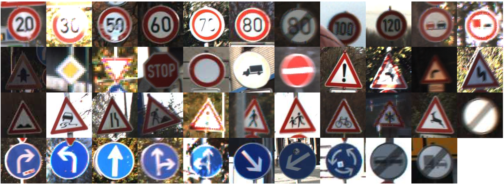

# Supervised and Unsupervised Classical Machine Learning

This project is the 1st of the course **Machine Learning**, part of the Master's program in Data Science and Machine Learning offered by the National Technical University of Athens.

It is composed of two parts:

 1. Learning how to classify [traffic signs](https://ieeexplore.ieee.org/document/6706807). See [source code](supervised.ipynb).
 2. Unsupervised Learning on [toy datasets](clustering_benchmarks_v1.ipynb). See [source code](unsupervised.ipynb).
