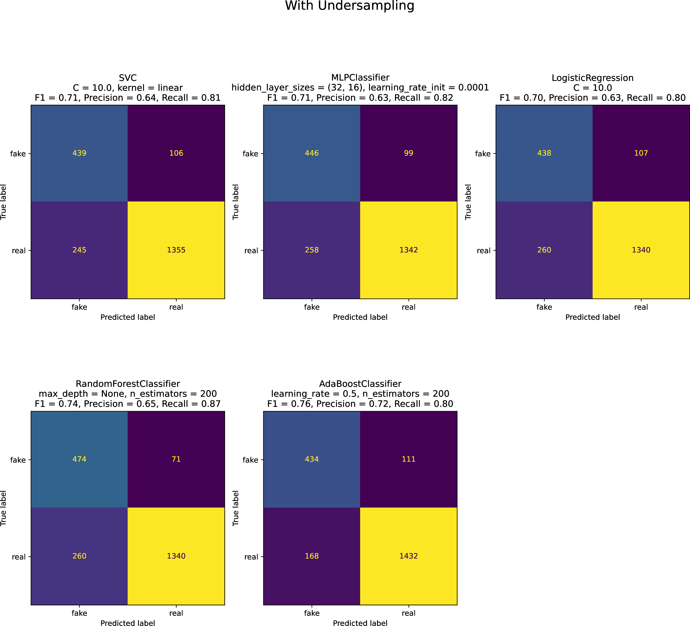
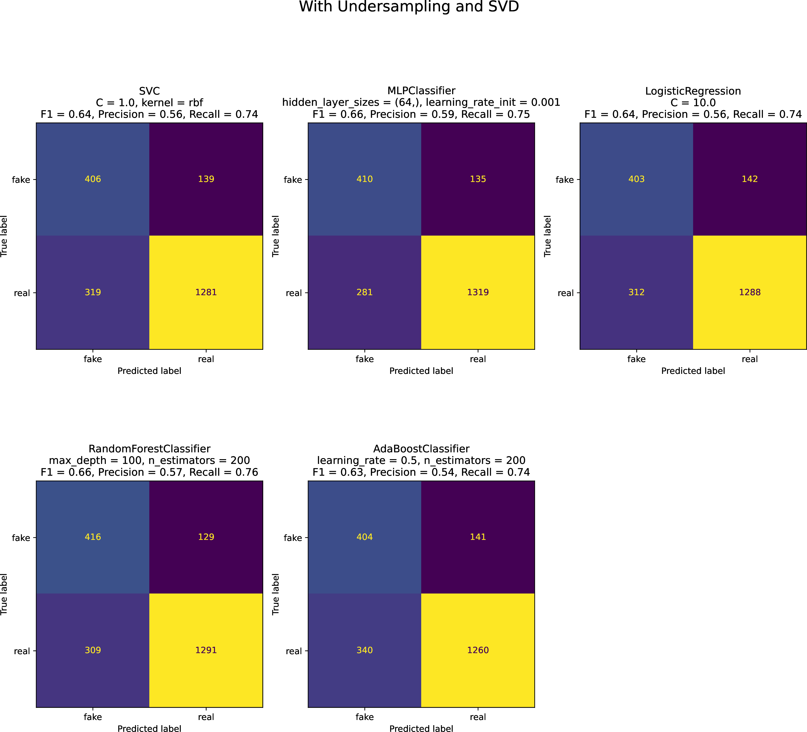

# Fake News Detection on Twitter with Classic Machine Learning

This project is the 2nd of the course **Machine Learning**, part of the Master's program in Data Science and Machine Learning offered by the National Technical University of Athens.

## Overview

The dataset is called [FakeNewsNet](https://github.com/KaiDMML/FakeNewsNet). It contains links to news articles as well as the ids of Twitter posts that linked this article. The content of the tweets can be downloaded by using the scripts of the dataset's github repository. This code utilizes the Twitter API, which one can access after specifically applying for access on Twitter (the application review may take a while).

The dataset we construct after downloading the tweets has each webpage article as a separate record. Each record has two fields: an input field (the Xs) and an output field (the ys). The input field is the concatenation of all the tweets related to the article, as well as the title of the article (this concatenation is appropriate because we will use a bag of word representation, so order is irrelevant). The output field is simply the labels which can take either the value real or the value fake. Our dataset contains additional information such as whether the labelling was from Gossipcop or from Politifact, but we are not going to utilize it. We then use a tf-idf representation of the inputs and train classical machine learning classifiers on it, more specifically:

* Support Vector Machines
* Feed-Forward Neural Networks
* Logistic Regression
* Random Forests
* AdaBoost

Our scoring criterion is the F1 score, because the dataset is relatively imbalanced and because since we think that both precision and recall are relevant when it comes to fake news detection. We try several configurations of the hyperparameters of each classifier, and we then choose the best one by using 5-fold cross validation.

## Data Preprocessing

Our dataset is comprised of 21443 samples. 16028 of them are labeled as real and 5415 as fake. The dataset is then split using a train size of 0.9 and a test size of 0.1. Because the dataset is relatively imbalanced, we undersample the training set, to help the algorithms avoid predicting too many news as real when in reality they are fake. The end result is 9740 training samples (4870 real and 4870 fake) and 2145 testing samples (1600 real and 545 fake). Because for many samples the number of related tweets is in the order of thousands, we randomly select a maximum of 11 tweets for each data point (11 is at the 25% quantile for the number of tweets). We concatenate the text contents of those tweets and we also concatenate the result of it with the article’s title. The result is a single block text which will be used as the input. Below example of a fake news input:

```none
Why Prince Harry sought Kate Middleton’s approval before proposing to Meghan Markle
Kate Middleton, Meghan Markle NOT Competing Over Charity Work, Despite Report https://t.co/AHj3gMYzIc
Kate Middleton, Meghan Markle NOT Competing Over Charity Work, Despite Report https://t.co/my5ZuMX3bD
Kate Middleton And Meghan Markle NOT Competing Over Charity Work, Despite Silly Report https://t.co/AHj3gMYzIc
```

And the following is an example of a real news input:

```none
James Corden Hosts ’Avengers: Infinity War’ Cast on Tour Around Los Angeles
Avengers Infinity War cast tours LA with James Corden https://t.co/dbYMT2JeS2
Avengers: Infinity War Cast Tours LA With James Corden - E! Online https://t.co/gls3HQYALT i got this from james corden. the title is ‘avengers: infinity war’ cast tours LA with james corden
```

We also replace the links with a placeholder word like `LINKREPLACEMENT`. The input is then passed into a `TfidfVectorizer` instance from scikit-learn, which takes care of the normalizing, tokenizing and the tf-idf computation. In addition to that we remove English stopwords by passing the parameter `stop_word=’english’`. To avoid having a huge vocabulary we ignore words that appear in more than 99% of the documents by passing the parameter `max_df=0.99`, and we also ignore words that appear in less than 0.5% of the documents by passing the parameter `min_df=0.005`. The resulting vocabulary size is 640. Each sample is then represented as a row of size 640 (each column representing a word) in a sparse array. The values of each row are the tf-idf values. Tf stands for term frequency and idf stands for inverse document frequency. Term frequency is simply the number times the word appears in the current document. Inverse document frequency is computed by $1 + \log(\frac{1+n}{1+f_d})$ where $n$ is the number of documents and $f_d$ is the number of documents where the word appears. Tf-idf is the product of tf and idf.

## Results

We used the following configurations for the algorithms and picked the
best ones according to their f1 score using grid-search with a 5-fold
cross validation.

* Support Vector Machines

  * $C \in \{0.1, 1.0, 10.0\}$

  * linear kernel, radial basis function kernel

* Feed-Forward Neural Networks

  * hidden layer sizes = (64,), (32, 16)

  * learning rate = 0.001, 0.0001

* Logistic Regression

  * $C \in \{0.1, 1.0, 10.0\}$

* Random Forests

  * number of trees = 100, 200

  * max depth of trees = None, 10, 30, 100

* AdaBoost

  * number of trees = 100, 200

  * learning rate = 0.5, 1.0, 2.0

In addition to that we attempted to reduce the dimensionality of our
space (vocabulary size = 640) to 100 by using Singular Value
Decomposition (SVD) and repeated the experiments. The results were
considerably worse.

The best parameters were:

* Without SVD

  * Support Vector Machines

    * $C = 10.0$

    * linear kernel

  * Feed-Forward Neural Networks

    * hidden layer sizes = (32, 16)

    * learning rate = 0.0001

  * Logistic Regression

    * $C = 10.0$

  * Random Forests

    * number of trees = 200

    * max depth of trees = None

  * AdaBoost

    * number of trees = 200

    * learning rate = 0.5

* With SVD

  * Support Vector Machines

    * $C = 1.0$

    * radial basis function kernel

  * Feed-Forward Neural Networks

    * hidden layer sizes = (64,)

    * learning rate = 0.001

  * Logistic Regression

    * $C = 10.0$

  * Random Forests

    * number of trees = 200

    * max depth of trees = 100

  * AdaBoost

    * number of trees = 200

    * learning rate = 0.5

Scores of the best classifiers without SVD

| **Classifier** | **F1** |  **Precision** |  **Recall**|
| --- | --- | --- | --- |
| SVM | 0.71 | 0.64 | 0.81 |
| Neural Network | 0.71 | 0.63 | 0.82 |
| Logistic Regression | 0.70 | 0.63 | 0.80 |
| Random Forest | 0.74 | 0.65 | 0.87 |
| AdaBoost | 0.76 | 0.72 | 0.80 |

Scores of the best classifiers with SVD

| **Classifier** | **F1** |  **Precision** |  **Recall**|
| --- | --- | --- | --- |
| SVM | 0.64 | 0.56 | 0.74 |
| Neural Network | 0.66 | 0.59 | 0.75 |
| Logistic Regression | 0.64 | 0.56 | 0.74 |
| Random Forest | 0.66 | 0.57 | 0.76 |
| AdaBoost | 0.63 | 0.54 | 0.74 |

Confusion matrices of the best classifiers without SVD



Confusion matrices of the best classifiers with SVD



## Conclusion

Even though we only implored classical machine learning techniques, the results look promising. The best-performing classifiers were Random Forest and Adaboost which is to be expected as ensemble methods are generally very powerful. SVM, Feed Forward Neural Network, and Logistic Regression performed approximately equally well, and this is what one encounters in most classification problems. There is definitely room for improvement, especially if we use more modern machine learning models such as Recurrent Neural Networks or Transformers. Furthermore instead of a simple bag-of-words encoding, one could encode each word using pre-trained embeddings for the English language such as word2vec. This way sequential information is retained and results are expected to improve.
