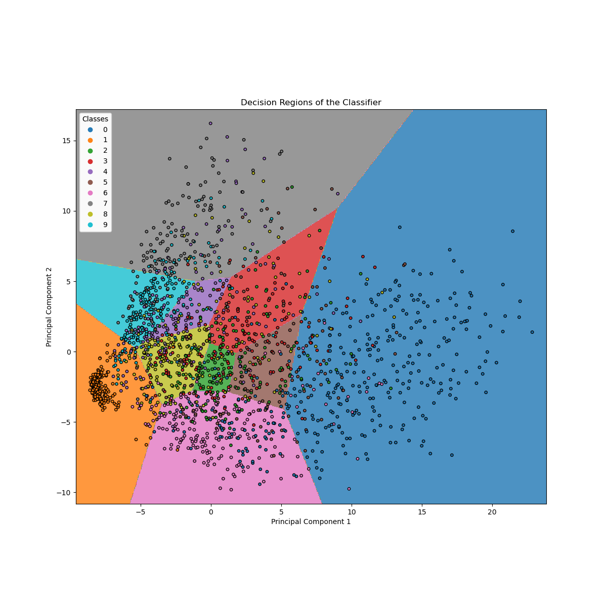

# MNIST hand-written digit classification

This project is the 1st lab of the course **Pattern Recognition**, part of the Master's program in Data Science and Machine Learning offered by the National Technical University of Athens.

The source code can be found in [classicml.py](classicml.py) and [deepl.py](deepl.py). [Project description/requirements in Greek](docs/PatRecCourse_Lab1.pdf). [Results presentation in Greek](docs/presentation.pdf).

## Project Requirements

1. Read the data
2. Plot the 131st digit of the train dataset.
3. Plot a random sample from each label.
4. Compute the mean at pixel (10, 10) for the digit 0 in the train dataset.
5. Compute the variance at pixel (10, 10) for the digit 0 in the train dataset.
6. Compute the mean and variance at all pixels for the digit 0 in the train dataset.
7. Plot the mean of 0 in the train dataset.
8. Plot the variance of 0 in the train dataset.
9. Compute the mean and variance for all digit in the train dataset. Plot the mean of each digit.
10. Classify the 101st digit of the test set with the class whose mean is the closest to that digit.
11. Classify all test samples by using the shortest distance from class means, like in step 10.
12. Implement step 11 with a scikit-learn classifier.
13. Use 5-fold cross validation to compute the score of the classifier of step 12. Plot the decision region of the classifier by using the first two principal components of the train dataset. Plot the learning curves of the classifier.
14. Compute the a-priori probabilities of the classes.
15. Implemented a Naive Bayes Classifier as a scikit-learn estimator. Compute the accuracy. Compare the custom implementation with sciki-learn's implementation (GaussianNB).
16. Repeat step 15, but now impose unit variance instead of computing it.
17. Compare the accuracy of Gaussian Naive Bayes, Nearest Neighbors and SVM.
18. Use Logistic Regression, Minimum Distance, Naive Bayes, and K-Neighbors to create two voting classifiers - one with soft voting and another one with hard voting. Then proceed to train and a bagging classifier composed of multiple K-Neighbor classifiers. Compare the results.
19. Create a simple feed-forward neural network to classify the digits.
