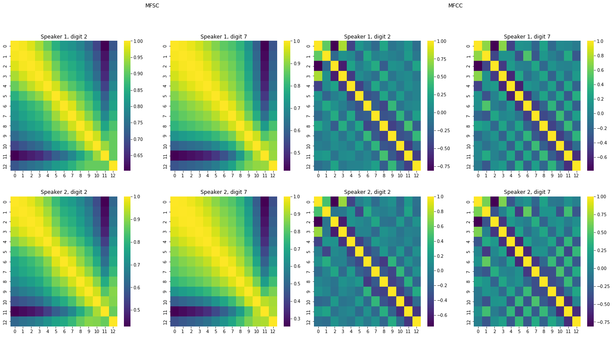

# Spoken Digit Classification

This project is the 2nd lab of the course **Pattern Recognition**, part of the Master's program in Data Science and Machine Learning offered by the National Technical University of Athens.

The source code can be found in [part1.py](part1.py) and [part2.py](part2.py). [Project description/requirements in Greek](docs/PatRec2021_Lab2.pdf). [Results presentation in Greek](docs/report.pdf).

## The Datasets

The project uses two datasets of audio files of people uttering a digit from 0 to 9. [The first dataset](data/part1/digits/) is used for steps 1-8, while the [second dataset](https://github.com/Jakobovski/free-spoken-digit-dataset) is used for steps 9-14.

## Project Requirements

1. Use [Praat](https://www.fon.hum.uva.nl/praat/) to extract the average pitch of and the first 3 formants of the vowels /a/, /u/, /i/ in [onetwothree1.wav](data/part1/onetwothree1.wav) and [onetwothree8.wav](data/part1/onetwothree8.wav).
2. Use [premades.parser](premades/parser.py) to load the data.
3. Extract the first 13 MFCCs, as well as the first and second order deltas, from each audio file.
4. Plot a histogram of the first and second MFCCs for two digits, spoken by two different people. Select an utterances of these two digits from these two people and plot the MFSC correlation matrix and the MFCC correlation matrix.
5. Concatenate the MFCCs and the first and second order deltas. Find the mean and variance across time for each sample. Make a scatter plot of the first two components of the mean vector, and another scatter plot of the first two components of the variance vector (use a different symbol for each digit class).
6. Repeat step 5 but instead of the first two components in the scatter plot, use the first two principal components. Repeat for the first three principal components.
7. Split the data into 70% train and 30% test subsets. Use the custom Gaussian Naive Bayes Classifier from lab 1, the GaussianNB implementation from scikit-learn, as well as three other classifiers of your choice to classify the digits. You can augment the MFCC and delta features by concatenating them with features like zero crossing rate.
8. Create cosine waves and train an RNN on them.
9. Split the train data into 80% train and 20% validation subsets.
10. Create a Hidden Markov Model with a Gaussian Mixture emission distribution and a left-right transition matrix. The number of hidden states and the number of gaussian components are hyperparameters for optimization.
11. Create 10 copies of the model in step 1. Each of these copies corresponds to a digit class and shall be trained on that digit class, with the Expectation Maximization algorithm.
12. After training the 10 models on their respective classes, inference is performed by choosing the class whose model had the maximum likelihood among all other models. Perform grid search on the the number of hidden states and number of gaussian components.
13. Plot confusion matrices for the validation and test set results.
14. Train a unidirectional and a bidirectional LSTM on the dataset. Use dropout, L2 regularization, and early stopping.
