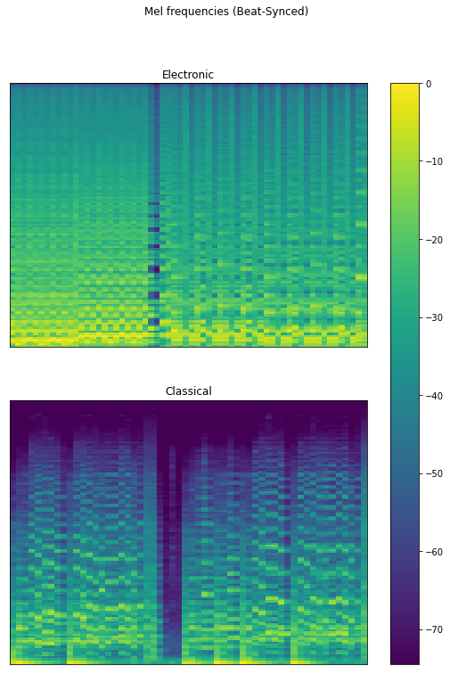

# Music Genre Classification

This project is the 3rd lab of the course **Pattern Recognition**, part of the Master's program in Data Science and Machine Learning offered by the National Technical University of Athens.

[Source code](main.py). [Project description/requirements in Greek](docs/PatRecCourse2021-22_Lab3.pdf). [Results presentation](docs/presentation.pdf).

## The Dataset

[Kaggle dataset](https://www.kaggle.com/datasets/geoparslp/patreco3-multitask-affective-music). [Kaggle competition](https://www.kaggle.com/competitions/multitask-affective-music-lab-2022/overview). 

## Project Requirements

0. Create a Kaggle notebook
1. Display sample mel spectrograms with labels. Comment on difference between labels.
2. Repeat step 1 for the beat-synced spectrograms.
3. Repeat step 1 for the chromatograms.
4. Merge genres with few samples into related genres with many samples.
5. Train LSTMs on the spectrograms and chromatograms to classify genres.
6. Create classification reports for the models.
7. Create a simple 2D CNN to classify the spectrograms.
8. Use the untrained models of steps 5 and 7 to perform single variable regression on each of the valence, energy and danceability *separately*, by removing the final layer.
9. Use the trained model of step 5 or 7 to perform transfer learning on the danceability.
10. Train a model to perform *multi-target* regression on the valence, energy and danceability.
